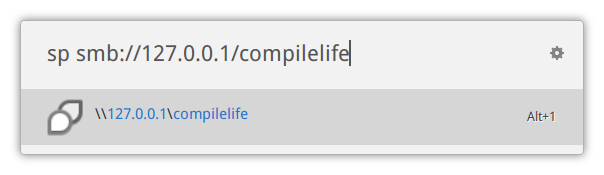
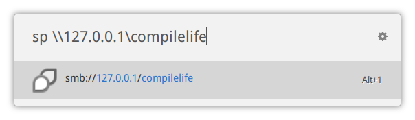

Extension for [ulauncher](https://ulauncher.io/) which convert samba path between linux and windows world. 

In Linux world, you got samba path like `smb://127.0.0.1/compilelife`. 

But Windows' guy sends you their samba path like `\\127.0.0.1\compilelife`.

It's horrible.

To make it easy, try ulauncher with this extension:





Then press Alt+1 or enter key to copy the converted path to clipboard.

Alternative, to those who prefer cmdline way(use without ulauncher), convert it with smbpath.py:

```
python smbpath.py smb://127.0.0.1/compilelife
```

or

```
python smbpath.py '\\127.0.0.1\compilelife'
```


Enjoy it.
